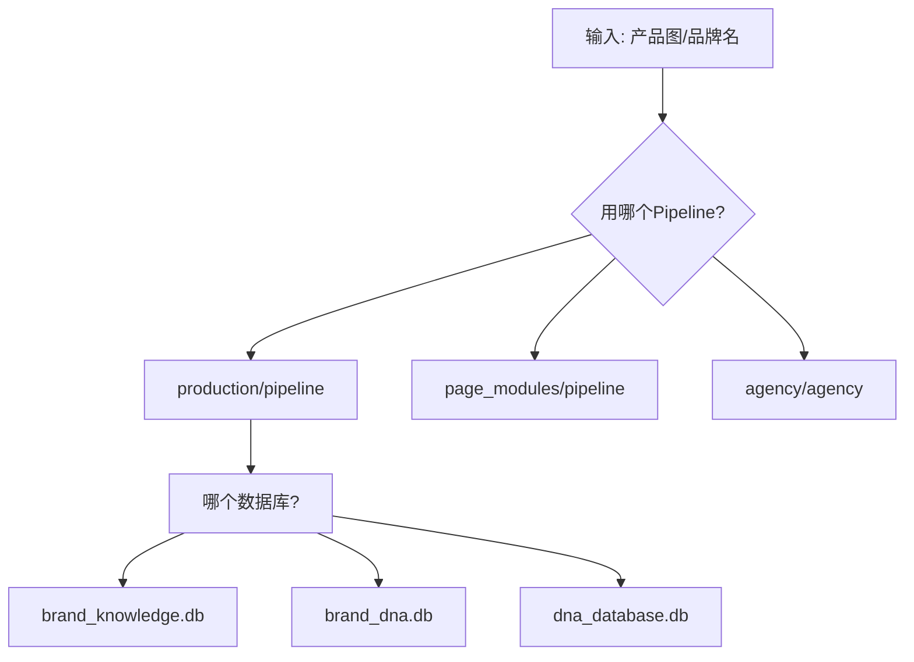

# Hermes Agent OS — 全模块架构审计报告
> CEO 审计 | 2026-07-15

## 一、重复检测

### 1.1 数据库孤岛 (5个独立存储)
| 文件 | 数据库 | 存储内容 |
|------|--------|---------|
| `knowledge/brand_knowledge.py` | `brand_knowledge.db` | 品牌档案/设计知识 |
| `knowledge/design_knowledge.py` | `design_patterns.db` | 设计模式库 |
| `agency/dna_ref.py` | `brand_dna_ref.db` | DNA参考数据 |
| `dna_engine/brand_db.py` | `brand_dna.db` | 品牌DNA条目 |
| `dna_engine/dna_database.py` | `dna_database.db` | DTCG令牌/质量门禁 |

**问题**: 同一份品牌数据散落在5个独立库里，无法交叉查询。

### 1.2 Pipeline重叠 (3个编排器)
| 文件 | 类名 | 功能 |
|------|------|------|
| `production/pipeline.py` | `BrandDesignPipeline` | 主集成器(13模块) |
| `page_modules/pipeline.py` | `PageModulesPipeline` | A→B→C→D流程 |
| `agency/agency.py` | `Agency4A` | 高层4A编排 |

**问题**: 用户不清楚该用哪个入口。

### 1.3 品牌研究模块重叠 (4个)
| 文件 | 功能 |
|------|------|
| `research/brand_researcher.py` | 品牌网络研究 |
| `page_modules/research_modules.py` | 6项研究(M1-M6) |
| `page_modules/brand_fullcase.py` | 4模块品牌全案 |
| `research/agency_researcher.py` | 4A公司案例研究 |

**问题**: 4个不同入口做相近的事情。

### 1.4 图像分析模块重叠 (4个)
| 文件 | 分析维度 |
|------|---------|
| `dna_engine/scene_parser.py` | 场景图(PBR/灯光/相机) |
| `page_modules/acr_analyzer.py` | ACR直方图 |
| `research/design_analyzer.py` | 设计语言/工具推断 |
| `research/color_system.py` | 色彩系统/心理学 |

**问题**: 4次独立GPT-4o Vision调用，可以合并为1次。

### 1.5 自进化机制重叠 (2个)
| 文件 | 机制 |
|------|------|
| `research/trend_tracker.py` | GitHub/Web趋势学习 |
| `dna_engine/mcp_bridge.py` | MCP设计指南接入 |

---

## 二、冲突分析

### 2.1 数据一致性问题
同一品牌 (如 "NORHOR") 可以同时存在于:
- `brand_knowledge.db` (品牌档案)
- `brand_dna.db` (DNA条目) 
- `brand_dna_ref.db` (参考数据)
- `dna_database.db` (DTCG令牌)

修改一个不更新其他 → **数据不一致**。

### 2.2 执行顺序不明确


### 2.3 权限/优先级冲突
- `production/pipeline.py` 和 `agency/agency.py` 都含 `_lazy_load()` 加载全部模块
- 同时调用时产生重复加载和资源竞争

---

## 三、连贯性分析

### 当前数据流 (有断点)
```
输入 → 品牌研究 → 场景图 → ACR分析 → 风格锁定 → 生成 → 校验
 ①        ②          ③        ④         ⑤       ⑥      ⑦

断点:
- ②→③: 品牌研究与场景图无数据传递
- ③→④: 场景图与ACR分析互相独立
- ⑤→⑥: 风格锁定结果未传递给生成器
- ⑥→⑦: 生成后校验未回写到知识库
```

### 理想数据流
```
输入 → 品牌研究 + 场景图 + ACR → 统一分析结果 → 风格锁定
                                         ↓
                                  品牌DNA知识库(统一)
                                         ↓
                                  生成 → 校验 → 入库 → 输出
```

---

## 四、重构方案

### 方案: 三阶段归一化架构

```
┌─────────────────────────────────────────────────────────┐
│ Stage 1: INPUT LAYER                                    │
│  输入: 产品图URL / 品牌名 / 竞品URL                      │
│  处理器: pipeline入口统一                                │
├─────────────────────────────────────────────────────────┤
│ Stage 2: ANALYSIS LAYER (统一1次Vision调用)              │
│  UnifiedVisionAnalyzer:                                 │
│   ├ 场景图(PBR/灯光/相机)                                │
│   ├ ACR直方图                                            │
│   ├ 设计语言/工具                                        │
│   ├ 色彩系统/心理学                                      │
│   └→ 一次GPT-4o Vision → 全部结果                        │
├─────────────────────────────────────────────────────────┤
│ Stage 3: KNOWLEDGE LAYER (统一数据库)                    │
│  UnifiedBrandDB:                                         │
│   ├ brands(品牌档案)                                     │
│   ├ tokens(DTCG令牌)                                     │
│   ├ patterns(设计模式)                                   │
│   ├ quality_gates(质量门禁)                              │
│   └ evolution_log(进化日志)                              │
├─────────────────────────────────────────────────────────┤
│ Stage 4: GENERATION LAYER                                │
│  参数化Prompt → 生图 → 详情页HTML/图片 → ZIP            │
├─────────────────────────────────────────────────────────┤
│ Stage 5: VALIDATION LAYER                                │
│  校验 → 偏差分析 → 知识库更新 → 版本迭代                 │
├─────────────────────────────────────────────────────────┤
│ Stage 6: EVOLUTION LAYER (统一)                          │
│  4A案例研究 + MCP趋势 + GitHub学习 → 知识库自进化        │
└─────────────────────────────────────────────────────────┘
```

### 具体行动项

| 优先级 | 行动 | 影响模块 | 工作量 |
|--------|------|---------|--------|
| P0 | 合并5个数据库为1个 `unified_brand.db` | brand_db, dna_database, brand_knowledge, design_knowledge, dna_ref | 高 |
| P0 | 统一Pipeline入口 `pipeline.py` | production, page_modules, agency | 中 |
| P1 | 合并4个Vision分析为1次调用 | scene_parser, acr_analyzer, design_analyzer, color_system | 中 |
| P1 | 合并4个品牌研究为1个 | brand_researcher, research_modules, brand_fullcase, agency_researcher | 中 |
| P2 | 合并2个自进化为1个 | trend_tracker, mcp_bridge | 低 |
| P2 | 规范数据流: 研究→分析→知识库→生成→校验→进化 | 全部 | 中 |

### 最终成品形态
```
一个入口 → 一次分析 → 一个知识库 → 一键生成 → 自动进化
```
